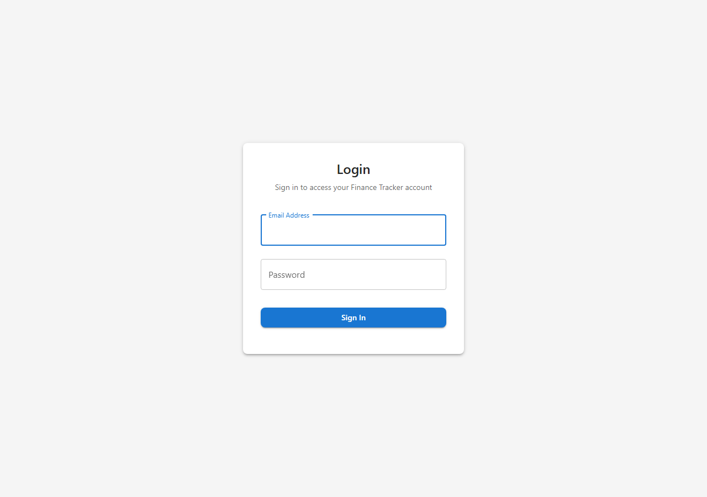

# Budget Management CRUD

**ADW ID:** 901a8a52
**Date:** 2026-01-13
**Specification:** specs/issue-25-adw-901a8a52-sdlc_planner-budget-management-crud.md

## Overview

Full-stack budget management system that allows users to set spending limits per expense category with visual progress tracking. Supports monthly, quarterly, and yearly budget periods with color-coded progress bars showing spending status against targets.

## Screenshots




## What Was Built

- Complete backend CRUD API for budgets at `/api/budgets/`
- Budget model, repository, service, and routes following Clean Architecture
- Spending calculation that aggregates transactions within budget periods
- Frontend BudgetsPage with list view, summary statistics, and progress indicators
- TRBudgetForm component for creating/editing budgets with validation
- TRBudgetCard component with color-coded progress bars and warning alerts
- Role-based delete permissions (admin/manager only)
- Comprehensive backend unit tests (673 lines)
- E2E test specification for budget management workflow

## Technical Implementation

### Files Modified

- `apps/Server/main.py`: Registered budget router
- `apps/Client/src/App.tsx`: Updated routing to use BudgetsPage component
- `apps/Client/src/types/index.ts`: Added Budget-related TypeScript interfaces

### Files Created

**Backend:**
- `apps/Server/src/models/budget.py`: SQLAlchemy Budget model with UUID primary key
- `apps/Server/src/interface/budget_dto.py`: Pydantic DTOs (Create, Update, Response, WithSpending)
- `apps/Server/src/repository/budget_repository.py`: Data access with spending calculation
- `apps/Server/src/core/services/budget_service.py`: Business logic and validation
- `apps/Server/src/adapter/rest/budget_routes.py`: REST API endpoints
- `apps/Server/tests/test_budgets.py`: Comprehensive unit tests

**Frontend:**
- `apps/Client/src/services/budgetService.ts`: API client for budget operations
- `apps/Client/src/hooks/useBudgets.ts`: State management hook
- `apps/Client/src/components/forms/TRBudgetForm.tsx`: Budget form with react-hook-form
- `apps/Client/src/components/ui/TRBudgetCard.tsx`: Card with progress bar visualization
- `apps/Client/src/pages/BudgetsPage.tsx`: Full page with dialogs and summary stats

**E2E Test:**
- `.claude/commands/e2e/test_budget_management.md`: E2E test specification

### Key Changes

- **Spending Calculation**: Repository aggregates transactions within budget date ranges using SQL sum queries, returning accurate spent amounts
- **Period Date Calculation**: End dates auto-calculated based on period type (monthly adds 1 month, quarterly adds 3 months, yearly adds 12 months)
- **Progress Color Coding**: Linear progress bars use green (<75%), yellow/warning (75-100%), red/error (>100%)
- **Duplicate Prevention**: Database constraint prevents duplicate budgets for same entity/category/period/start_date
- **Category Validation**: Only expense-type categories can have budgets (income budgets rejected)

## How to Use

1. Navigate to the Budgets page from the sidebar menu
2. Click "Add Budget" to create a new budget
3. Select an expense category from the dropdown
4. Enter the budget amount (positive number)
5. Choose period type: Monthly, Quarterly, or Yearly
6. Select the start date for the budget period
7. Click Save to create the budget
8. View spending progress in the budget cards
9. Click the edit icon to modify budget settings
10. Admin/manager roles can delete budgets using the delete icon

## Configuration

No additional configuration required. Budgets use the existing database schema (`budgets` table) and authentication system.

Environment variables remain unchanged from base project:
- `DATABASE_URL`: PostgreSQL connection string
- `JWT_SECRET_KEY`: JWT signing key

## Testing

**Backend Tests:**
```bash
cd apps/Server && uv run pytest tests/test_budgets.py -v
```

**Frontend Validation:**
```bash
cd apps/Client && npm run typecheck && npm run lint && npm run build
```

**E2E Test:**
Execute `.claude/commands/e2e/test_budget_management.md` following the test_e2e.md runner documentation.

## Notes

- Budgets are entity-scoped: each entity maintains separate budget tracking
- Budget periods are calculated from start_date forward (not calendar-aligned)
- Warning alerts appear at 75% spending and error alerts when exceeding 100%
- Delete operation requires admin or manager role
- Budget date ranges determine which transactions are included in spending calculations
- Category must be expense type; income categories are rejected
